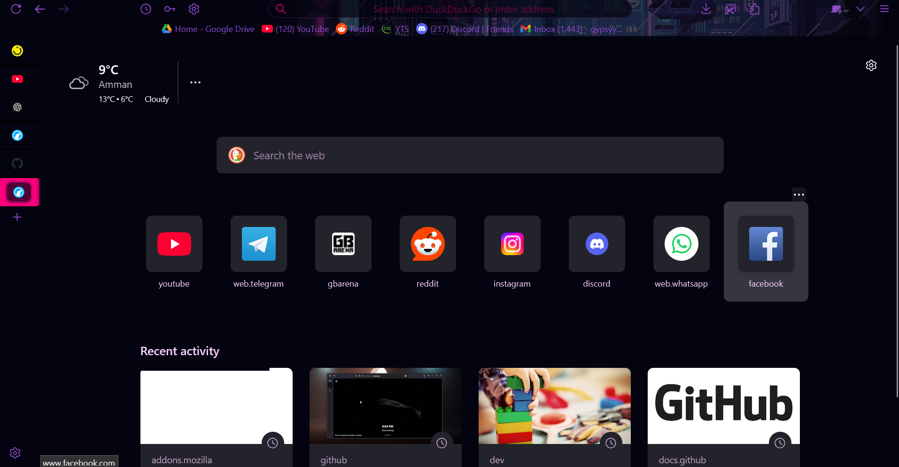

# My Project

This is a project that I created that suits and works well with the [PixelPunk Dynamic theme](https://addons.mozilla.org/en-US/firefox/addon/pixel-punk-dynamic-theme/).
Please provide any valuable information that could help me improve on my css.
I'll try to keep updating the repo, I'm using librewolf so the css worked well with me

# Installation

1-Create a new tab and type in the address bar about:config set the siderbar.revamp to true and siderbar.verticalTabs to true.

2-Create a new tab and type in the address bar about:profiles then go to the root directory then open folder

3-Copy the chrome folder and just paste it

4-Re open firefox

## License

This project is licensed under the MIT License - see the [LICENSE.md](LICENSE.md) file for details.

## External Links

- Check out my [GitHub Profile](https://github.com/OakGhost98).
- Check out the creator of the [Dynamic theme](https://addons.mozilla.org/en-US/firefox/user/16901315/)
